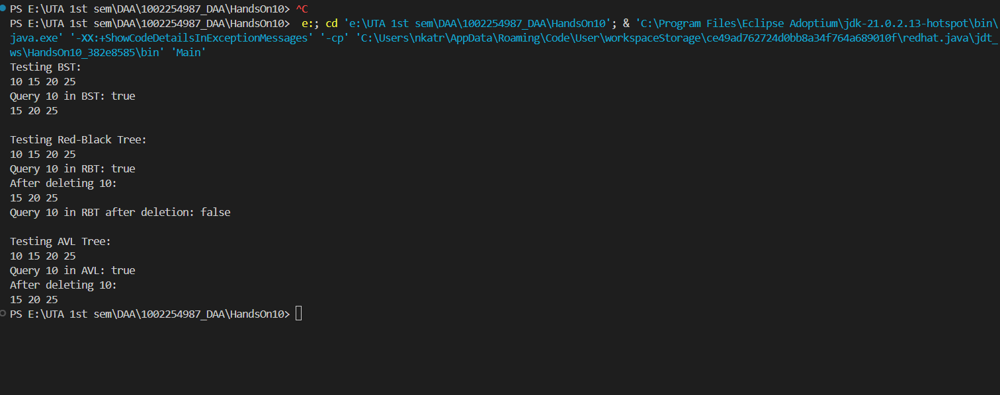

# HandsOn_10
* Test case of these three tree is given [Main.java](Main.java)
* Code for Binary Search Tree is Given [BinarySearchTree.java](BinarySearchTree.java) 
* Code for Red Black Tree is Given [RedBlackTree.java](RedBlackTree.java) 
* Code for AVL Tree is Given [AVLTree.java](AVLTree.java)  
* OUTPUT of all three tree is mentioned in below photo  
