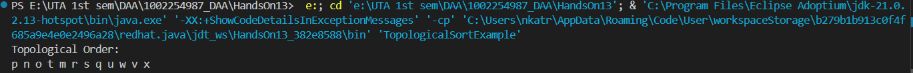
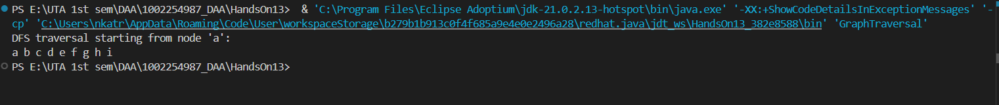
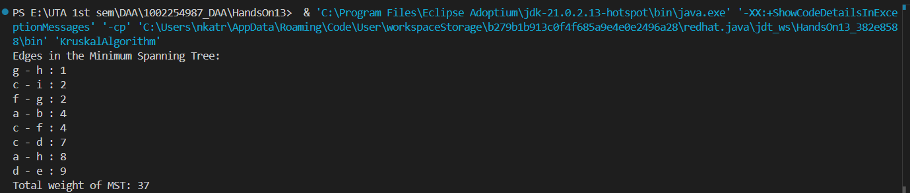

# HandsOn_13  
## Problem 1 
Code for Topological sort is given : [TopologicalSortExample.java](TopologicalSortExample.java)  

Code for Depth First Serach is given : [DFS.java](DFS.java)  

Code for Topological sort is given : [KruskalAlgorithm.java](KruskalAlgorithm.java)  

