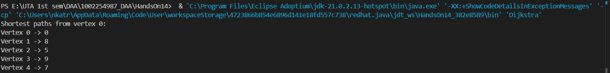
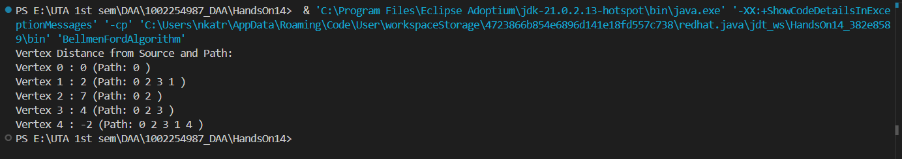
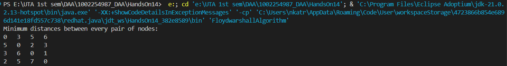

# HandsOn_14  
## Problem 1 
Code for Dijkstra Algorithm is given : [Dijkstra.java](Dijkstra.java)  

Code for Bellman-Ford Algorithm is given : [BellmenFordAlgorithm.java](BellmenFordAlgorithm.java)  

Code for Floydwarshall is given : [FloydwarshallAlgorithm.java](FloydwarshallAlgorithm.java)  

