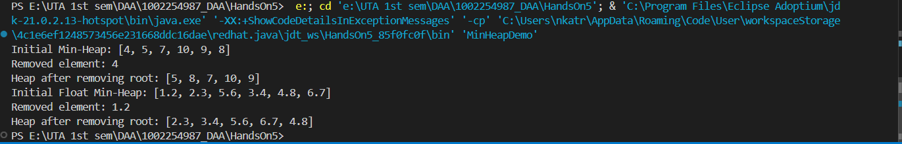

[Code of MinHeap is MinHeap.java](MinHeap.java "")

* All Functionality are in output   
  
## Demonstration of All Functionality 
1. Bit Manipulation Operators for Parent and Children Indices : 
parent(int i): Which Uses >> 1 for right shift by one bit, and dividing the index by 2. 
leftChild(int i) and rightChild(int i): Which Use << 1 for left shift by one bit, which multiplies the index by 2.  
2. Build the Heap (buildMinHeap): 
buildMinHeap(List T items): Takes a list of items and builds the min heap by iterating from the last parent node to the root and applying minHeapify.  
3. Heapify (minHeapify): 
minHeapify(int i) is Ensures the subtree which is rooted at index i maintains the min-heap property, comparing the node with its children and swapping where necessary.  
4. Pop the Root (pop): 
pop() removes and returns the root of the heap. It replaces the root with the last element in the heap and then re-heapifies to maintain the heap structure.  
5. Generic Data Type Compatibility: 
The MinHeap class is defined with a generic type parameter T extends Comparable T. which is allowing it to handle any datatype that implements the Comparable interface. This means the heap can manage integers, floats, and any other custom data structures as long as they are comparable.  
6. Example Demonstrations: 
MinHeapDemo class creating a heap with integers and floats, adding elements, removing the root, and printing the whole heap at various stages to show its functionality.