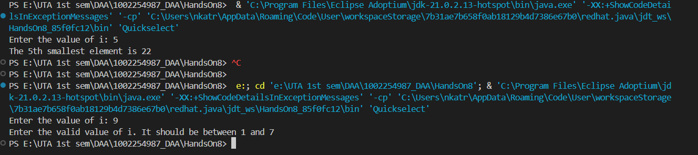
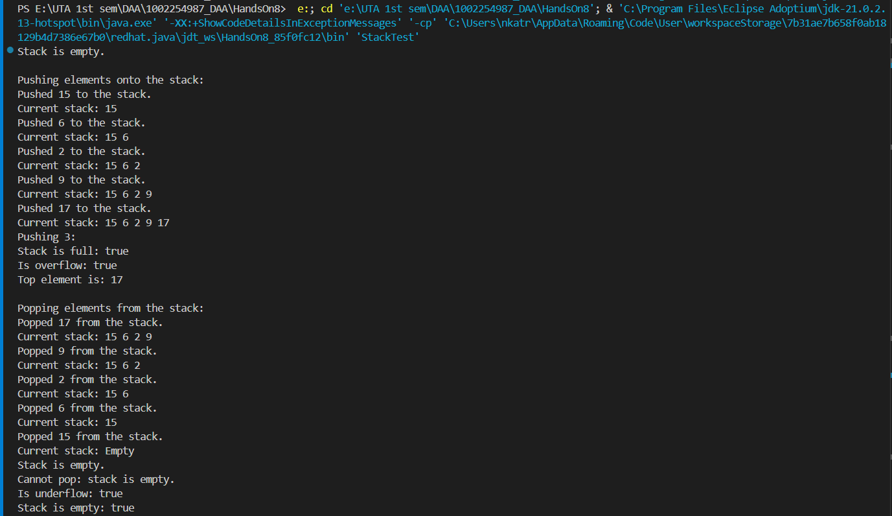
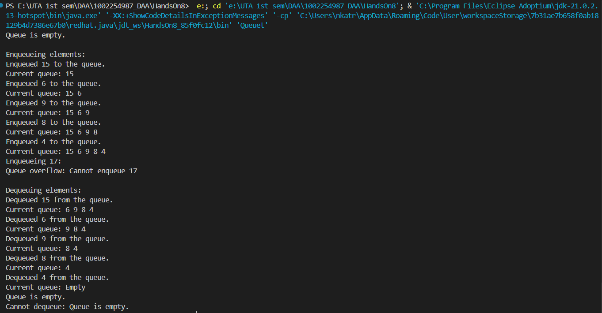
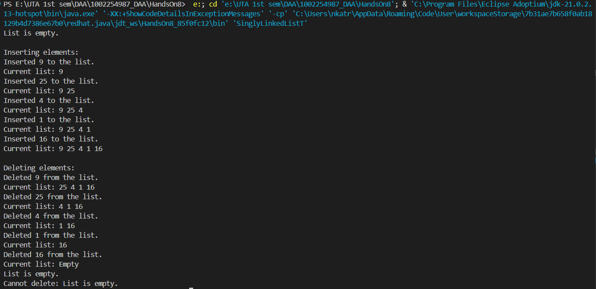

# HandsOn_8 
## Question 1  
* Code of quicksort to implement the ith order statistic is [Quickselect.java](Quickselect.java)  
Output:  
## Question 2  
* Code of Stack Implementation is [Stackt.java](Stackt.java)  
Output:  
* Code of Stack Implementation is [Queuet.java](Queuet.java)  
Output:  
* Code of Stack Implementation is [SinglyLinkedListT.java](SinglyLinkedListT.java)  
Output:  