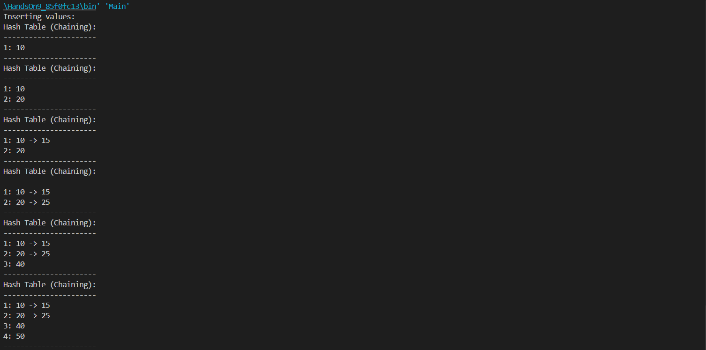

# HandsOn_9
* Code is given for Hashtable  [CustomHashTable.java](CustomHashTable.java)  [DoublyLinkedList.java](DoublyLinkedList.java)  [Main.java](Main.java)
* After Compiling all the code output is 
